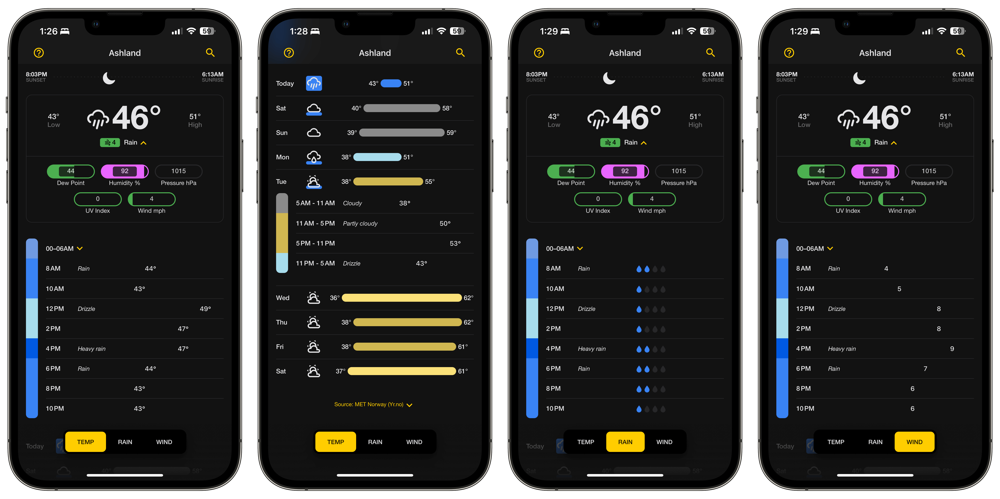
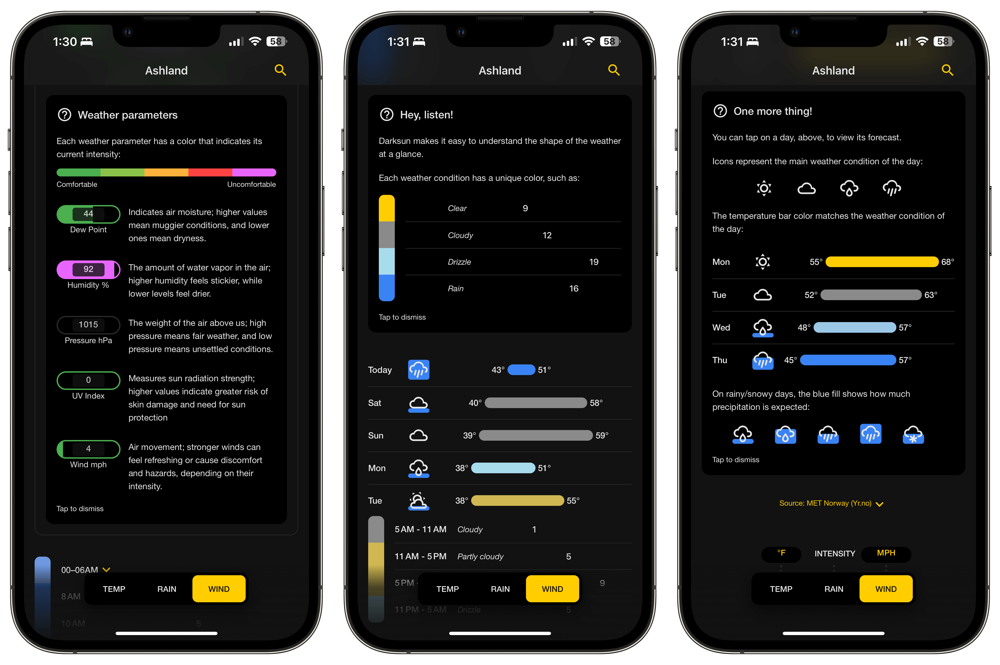

import Link from "../../components/Link.astro";
import SocialIcon from '@/components/social-icons/index.astro';

Last weekend, I saw a <Link href={`https://www.reddit.com/r/apple/comments/1c9dsov/darksun_weather_a_free_spiritualsuccessor_to_dark/`} class="text-primary-500 hover:text-sky-600 dark:hover:text-primary-400">post on the Apple subreddit</Link> about a new weather app that immediately piqued my interest. 

## An Homage To The Former Weather King

The developer, <Link href={`https://iconof.com`} class="text-primary-500 hover:text-sky-600 dark:hover:text-primary-400">Kostas Mavropalias</Link>, sums it up best in his own words:

>TL;DR: I loved Dark Sky's UI, features, and no-subscription model. I built Darksun Weather as an homage to what made Dark Sky great, bringing in new ideas and modern features, while keeping it free (sorry, no weather alerts & radar!), without ads/tracking/data collection/subscription.

The fact that it is free with zero ads or data collection is really nice, although that comes at the expense of a less feature-rich app, which makes sense. Anyone who expects premium features should expect to pay a premium price.

## Weather At A Glance

In the Reddit post, he mentions that he aims to make weather data useful for daily life. The idea is to allow users to glance at the app for a few seconds and understand the current weather. After using it for a few days, I think he's mostly achieved that. 

The only thing that's holding it back is some of the icon choices, and the UI being a combination of "dumbed down and detailed," as mentioned by <Link href={`https://www.reddit.com/r/apple/comments/1c9dsov/comment/l0n1rm8/`} class="text-primary-500 hover:text-sky-600 dark:hover:text-primary-400">a commenter</Link>. This is definitely some good feedback and I hope the developer considers adding more complexity to rain data.

## Minimal Settings With Helpful Tips

Darksun stands out for its minimalist approach, particularly in the settings department, which aligns with its goal of simplicity and ease of use. The app smartly introduces users to its interface through helpful alerts and guides, easing them into the UI without overwhelming them with options.

You can access these anytime after dismissing them by tapping the question mark at the top left of the app in case you need a reminder of what certain UI elements mean.

This approach not only streamlines the user experience but also subtly educates on how to interpret the nuanced weather data presented.
## Dark Mode Needs A Little Work

One feature that needs some polish is the dark mode implementation. It's not obvious on how to toggle it on or off, and it doesn't inherit the user's preference set by iOS. To toggle dark mode you tap the anywhere right under the navigation bar, which is a little unintuitive.

While not a deal-breaker, I hope that he at least adds in a system dark mode, it shouldn't be more than a half a dozen or so <Link href={`https://medium.com/@mammadowr/how-to-support-dark-mode-in-an-ios-app-swift-swiftui-objective-c-e83bdf06d22c`} class="text-primary-500 hover:text-sky-600 dark:hover:text-primary-400">lines of code</Link>.

## Powered By Open-Source Data

To keep Darksun free, he is using a few open-source data providers.

- **Open-Mateo and MET Norway:** Both of which look like really awesome weather services that provide data for free.
    - <Link href={`https://open-meteo.com`} class="text-primary-500 hover:text-sky-600 dark:hover:text-primary-400">Open-Meteo</Link>
    - <Link href={`https://www.met.no/en/About-us`} class="text-primary-500 hover:text-sky-600 dark:hover:text-primary-400">MET Norway</Link>:

- **OpenStreetMap's Weather API:** Who provides a free API to access weather data with a limit of 1000 API calls per day.
    - <Link href={`https://openweathermap.org/api`} class="text-primary-500 hover:text-sky-600 dark:hover:text-primary-400">OpenWeather</Link>

It would be interesting to see how he keeps that OpenWeather load under the limit.

## Hinting At More Features

He later suggests that a private version of Darksun, currently available only to friends and family, incorporates Apple’s Weather API, offering minute-by-minute precipitation alerts. 

He indicates the possibility of making this version publicly available in the future, potentially with a subscription fee to offset operational costs. I personally hope there is sufficient interest to encourage him to proceed with this plan, and support him one hundred percent.

## Free Forever With Optional In-app Purchases Or Subscriptions

In keeping with the principles of open-source development, the creator of Darksun is committed to keeping the core application free for all users. This ensures that everyone can access reliable weather forecasts without financial barriers.

However, to accommodate the needs of users who desire more detailed information and advanced features, Darksun will have optional in-app purchases. Additionally, for those who require even more robust weather data, premium sources can be accessed through subscriptions.

These options are designed not only to cater to varying user preferences but also to support the ongoing development and improvement of the app, balancing accessibility with advanced capabilities.

## Only Time Will Tell If Darksun Can Weather The Future

The app is still very new, but it looks like there are good things in store if he remains committed. Dark Sky's shadow is quite large and difficult to shine through, but perhaps it will stand the test of time and gain enough popularity for him to justify devoting the time and resources it would take to become a worthy successor.

## Download Darksun On The App Store

If you're looking for an alternative to the Apple Weather app, go ahead and tap the badge to download Darksun on the App Store, and be sure to check out the <Link href={`https://darksunapp.com`} class="text-primary-500 hover:text-sky-600 dark:hover:text-primary-400">app's website</Link> as well!

<SocialIcon kind="appstorebadge" href="https://apps.apple.com/us/app/darksun-weather/id1670009547" target="_blank"/>

***

## Thanks For Reading!

As always, thanks for stopping by and I hope you check out this app. If you enjoyed reading about it let me know what you think in the comments below.

Have a good one, peace! 🤙

{/* 

TODO:

- Mention The Simplicity Of No Settings, But Also The Helper Alerts
- Add App Store Badge
- Add Link To App Website

*/}