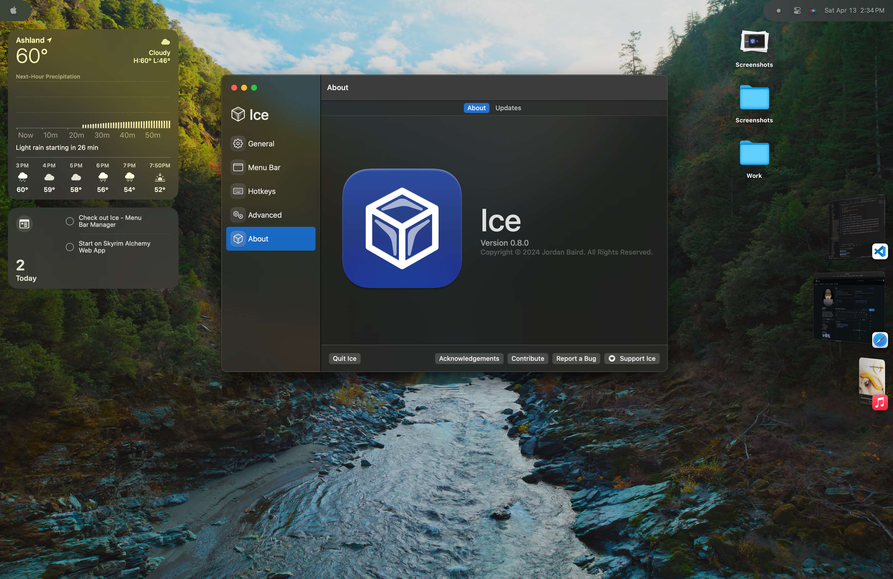
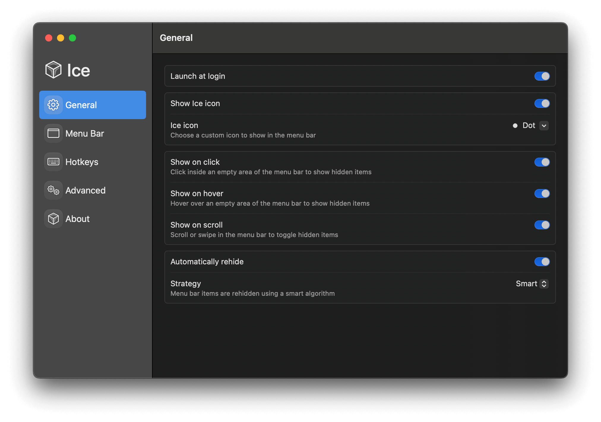
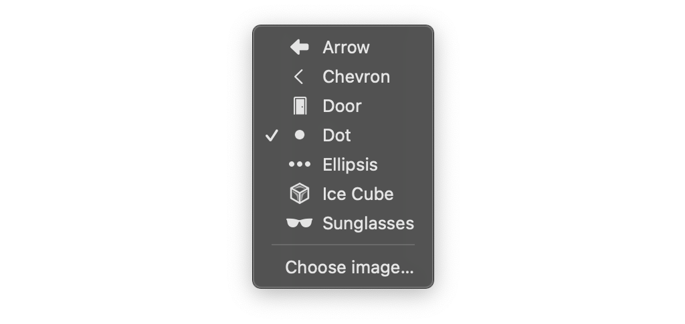

import Link from "../../components/Link.astro";

<a class="github-button" href="https://github.com/jordanbaird" data-color-scheme="no-preference: light; light: light; dark: dark;" data-size="large" data-show-count="true" aria-label="Follow @jordanbaird on GitHub">Follow @jordanbaird</a>
<a class="github-button" href="https://github.com/jordanbaird/ice" data-color-scheme="no-preference: light; light: light; dark: dark;" data-icon="octicon-star" data-size="large" data-show-count="true" aria-label="Star jordanbaird/ice on GitHub">Star</a>
<a class="github-button" href="https://github.com/jordanbaird/ice/issues" data-color-scheme="no-preference: light; light: light; dark: dark;" data-icon="octicon-issue-opened" data-size="large" data-show-count="true" aria-label="Issue jordanbaird/ice on GitHub">Issue</a>

## An Open Source Menu Bar Manager

Meet Ice, an open-source menu bar manager that offers robust features and customization options tailored for MacOS users. Designed with both simplicity and functionality in mind, Ice allows you to declutter your desktop and access your most-used applications and services with ease.

Whether you’re a power user or just looking for a more organized workspace, Ice introduces an elegant solution to enhance your daily computing tasks.

## Installing <Link href={`https://github.com/jordanbaird/Ice/releases`} class="text-primary-500 hover:text-sky-600 dark:hover:text-primary-400">Ice By Jordan Baird</Link> From GitHub

To install Ice, head on over to the GitHub repo linked above and grab the latest release, which is `0.8.0` as of this post.

In case you've never installed anything from GitHub before:

- Click on the zip file under the Assets heading and it will prompt you to allow downloads from `objects.githubusercontent.com`. Click "Allow".
- After the file is downloaded, double-click to unzip the file and move it to your Applications folder.
- Then launch Ice by clicking on the icon in your Applications folder or with Spotlight.
- Ice will open and you'll see a screen like the below screenshot.

## Ice's Features And Functionality

Ice's general settings reveal a user-friendly approach to MacOS menu bar management. It offers customizable visibility options like 'Show on click', 'Show on hover', and 'Show on scroll', along with 'Automatically rehide' to keep the desktop uncluttered.

**Launch at login:** This setting should be enabled at all times, what would be the point of having to enable it every time?

**Show Ice icon:** Same as above, it's nice to see an icon that indicates that Ice is actively hiding your icons.

**Ice icon:** Ice provides some nice icons to choose from and also allows you to use your own, which is very nice.

**Show on click & Show on hover:** I have both of these enabled in case Ice doesn't recognize me hovering fast enough. It enables you to click to hide them as well.

**Show on scroll:** This one is nice as well, you swipe with two fingers to show or hide icons.

**Automatically rehide:** For now I have this one on as well, just in case I forget to swipe or click to hide everything.

**Strategy:** This feature employs a 'smart algorithm' to organize menu bar items efficiently. I have only been using it since this morning so I'm not really sure how it works in practice.

This suite of features positions Ice as an intuitive tool designed to enhance user experience through simplicity and smart design. 

I will be putting it through its paces and likely reporting some bugs I’ve already experienced, but so far, this seems like a great free alternative to <Link href={`https://www.macbartender.com`} class="text-primary-500 hover:text-sky-600 dark:hover:text-primary-400">Bartender $(16.00)</Link>, at least for minimal functionality.

You can also get Bartender as part of <Link href={`https://setapp.sjv.io/c/5403212/443665/5114`} class="text-primary-500 hover:text-sky-600 dark:hover:text-primary-400">SetApp</Link>, which is an awesome subscription service to get a bunch of different apps for once price.

Thanks for stopping by! I'd love to hear your experiences with Ice or any questions you might have — drop a comment below!