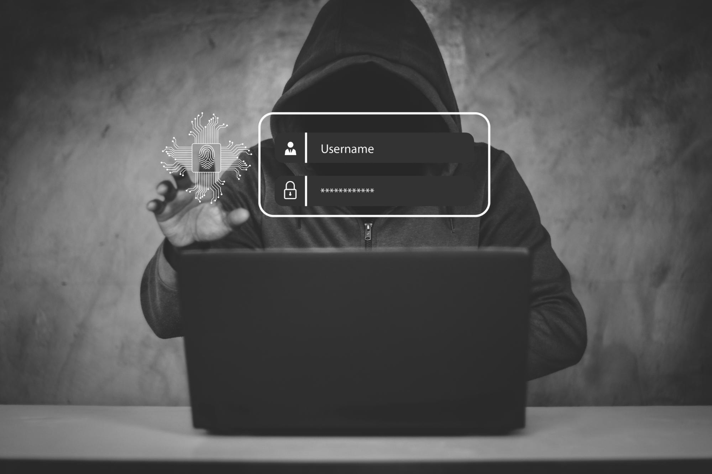

import Link from "../../components/Link.astro";

## I Saw This Today On Mastodon

Today on Mastodon, I came across a scarry new scam that cleverly manipulates both phone-based and digital banking safeguards. *Remember, If you think your bank is calling you, always hang up and call back.*

<iframe src="https://mastodon.social/@Edent/112372412442888807/embed" class="mastodon-embed mx-auto" style="max-width: 100%; border: 0" width="400" allowfullscreen="allowfullscreen"></iframe>

## He Goes On To Mention Just How Sophisticated This Attack Is

Here's how it works: You receive a phone call from someone claiming to be from your bank, alerting you to suspected fraudulent activity on your account. 

This might immediately raise your suspicions as a potential scam, but then the caller offers to send you an in-app notification as proof of their legitimacy.

<iframe src="https://mastodon.social/@Edent/112372420335925276/embed" class="mastodon-embed mx-auto" style="max-width: 100%; border: 0" width="400" allowfullscreen="allowfullscreen"></iframe>

## Some Steps You Can Take To Protect Yourself

- **Verify Independently:** Never trust caller ID or an incoming phone number. If you receive a call from someone claiming to be from your bank, hang up and call back using the official number from your bank's website or your bank card.
- **Do Not Share Personal Information:** During the call, do not share personal information or enter any details into your phone unless you have initiated the call and are certain of the recipient's identity.
- **Be Wary of Pressure:** Scammers often create a sense of urgency to prompt hasty decisions. Take your time and consult with someone you trust if you feel pressured.
- **Use Two-Factor Authentication:** Enable two-factor authentication for your bank and other sensitive accounts, which adds an extra layer of security beyond just a username and password.
- **Employ Complex Passwords:** Use a tool like <Link href={`https://links.jpshlk.com/bitwarden`} class="text-primary-500 hover:text-sky-600 dark:hover:text-primary-400">Bitwarden's</Link> free version to generate and manage complex passwords, adding another layer of security against unauthorized access.
- **Stay Informed:** Keep up to date on the latest scam tactics. Banks often inform customers of common fraud techniques through their websites or emails.

## Staying Safe Means Being Smart - And It Takes Work

There you have it—a glimpse into the crafty world of modern scams that may hit closer to home than we'd like!

Keeping our digital lives secure isn't just smart; it's necessary. Remember, it's all about staying vigilant, using strong passwords with tools like Bitwarden, and keeping informed. Let's keep our online environments safe and scam-free.

Spread the word, stay curious, and as always, make your digital footprint a secure one!

## Update From Terence

Terence also did a great <Link href={`https://shkspr.mobi/blog/2024/05/bank-scammers-using-genuine-push-notifications-to-trick-their-victims/`} class="text-primary-500 hover:text-sky-600 dark:hover:text-primary-400">write up</Link> on his site. Head on over and give his post a read.

Here is the original Reddit post:

<blockquote class="reddit-embed-bq" style="height:316px" data-embed-theme="dark" data-embed-height="316"><a href="https://www.reddit.com/r/UKPersonalFinance/comments/1cih3kd/been_scammed_over_18000_through_my_chase_account/">Been scammed over £18,000 through my Chase account which is an extremely significant amount, around two years of savings.</a> by<a href="https://www.reddit.com/user/Captain_Levi_00/">u/Captain_Levi_00</a> in<a href="https://www.reddit.com/r/UKPersonalFinance/">UKPersonalFinance</a></blockquote>

***

As always, thanks for stopping by and I hope you take this stuff seriously. If you enjoyed reading about it let me know what you think in the comments below.

Have a good one, peace! 🤙