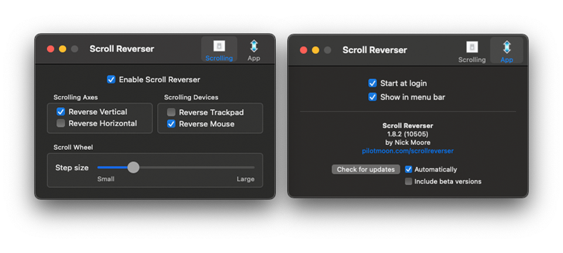

## There’s Literally Zero Reason Why This Isn’t A Native Feature 

There are a lot of things that Apple gets right, and a lot of them are under-the-hood so to speak. However, occasionally there are some things that make me scratch my head. I ran into a little problem when I wanted to use a Mouse and the Magic Trackpad in tandem, but have the scrolling set differently per device.

I want to be able to have the Trackpad settings similar to how an iPhone or iPad work, where I push with two fingers up and it scrolls up, and pull down to scroll down. Then for the mouse, I want it to scroll normally, like a sane person… 

## Enter [Scroll Reverser](https://pilotmoon.com/scrollreverser/) By Nick Moore

This tiny app completely solves this edge-case issue. You can download it from the link above, or check out the [GitHub repo](https://github.com/pilotmoon/Scroll-Reverser).

The settings are minimal and self-explanatory. Check it out and give it a star if you'd like!

<a class="github-button" href="https://github.com/pilotmoon/Scroll-Reverser" data-color-scheme="no-preference: light; light: light; dark: dark_high_contrast;" data-icon="octicon-star" data-size="large" data-show-count="true" aria-label="Star pilotmoon/Scroll-Reverser on GitHub">Star</a>