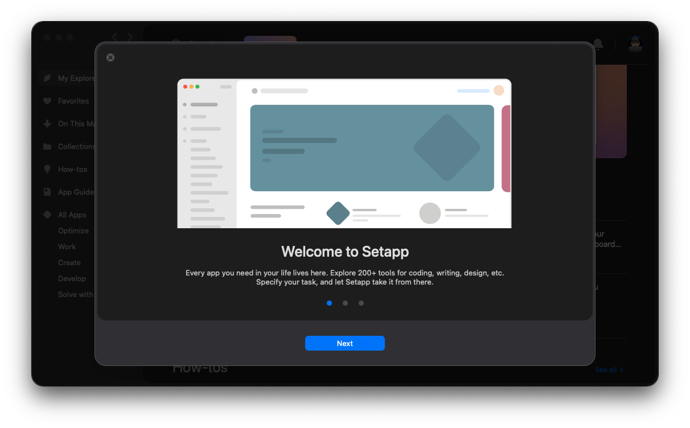

import Link from "../../components/Link.astro";
import SocialIcon from '@/components/social-icons/index.astro';

I finally checked out Setapp, and I don't know what I was waiting for.

## Dozens Of Powerful Apps Under One Subscription

Subscriptions have become a bad word in recent times—and for good reason. From streaming your favorite movies and TV shows to online gaming; hell, there are even food deliveries services for both you and your pets, it seems there's a subscription for everything. But what about for software?

Enter Setapp, a subscription service that promises to simplify your digital life without cluttering it with unnecessary expenses.

Whether you are a power user or a casual, Setapp is worth at least checking out. It couldn't hurt with a free 7-day trial.

## Is The Value Proposition Worth It?

Before you shy away from the ten-dollar-per-month cost, I'll walk you through what I've calculated so far.

I have installed a total of ten apps within the few weeks that I've been testing Setapp, some of which don't have free trials on their own. The total cost of purchasing or subscribing to these would be almost $190 US. So, $9.99 per month starts to sound pretty good when you do the math.

Now, I'll admit the value proposition does get a bit more tricky to work out the longer you are subscribed. A few of those apps are subscription-only, or the one-time purchase only guarantees one year of updates.

This is also only taking into account the fact that I've barely scratched the surface of their impressive collection. I'm sure that I likely won't ever use even a quarter of the apps that they offer, but it is nice to have a curated selection to choose from when needed.

## Here's A Quick Breakdown Of The Apps, The Cost, And Some Notes:

I'm not going to add up the cost of all ten apps, but here are my favorites that I use multiple times daily at work and when working on my own personal projects.

### <Link href={`https://links.jpshlk.com/bartender`} class="text-primary-500 hover:text-sky-600 dark:hover:text-primary-400">Bartender 5 - $16:</Link>

#### A menu bar manager that offers a lot of features and customization.
    - 4 week trial
    - Bartender 4 was released in April of 2021 for $15.
    - Upgrade from 4 for 50% off.

### <Link href={`https://links.jpshlk.com/cleanshotx`} class="text-primary-500 hover:text-sky-600 dark:hover:text-primary-400">CleanShot X - $29:</Link>

#### Adds a ton of screenshot features over macOs's built-in functionality.
    - 30-day money back guarantee.
    - One year of updates, optionally renew at $19 annually for updates.
    - $10 per month, or $8 per month if paying for a year.
    - Comes with cloud storage, and a custom domain if that's your thing!

### <Link href={`https://links.jpshlk.com/pixelsnap2`} class="text-primary-500 hover:text-sky-600 dark:hover:text-primary-400">PixelSnap 2 - $39:</Link>

#### A tiny app that will accurately measure anything on your screen, within any app.
    - No trial, 30-day money back guarentee.
    - Discounts on multiple licenses.
    - Integrates with CleanShot X!

### <Link href={`https://links.jpshlk.com/sip`} class="text-primary-500 hover:text-sky-600 dark:hover:text-primary-400">Sip - $20:</Link>

#### Another tiny app that lets you grab color values from anything on your screen.
    - 1 year of updates.
    - 50% off on licence exension.
    - Can grab more than just hex values, and organize color pallets.

### <Link href={`https://links.jpshlk.com/istatmenus`} class="text-primary-500 hover:text-sky-600 dark:hover:text-primary-400">iStatMenus 6 - $11.99:</Link>

#### A powerful Mac system monitor that provides detailed stats in the menu bar.
    - No trial, Mac App Store (Feature Limited).
    - $9.99 to upgrade.
    - Tons of features I've yet to explore.

All of those apps are a cup of coffee away from totaling what it costs to pay for Setapp for a year. If you use your Mac like I do, and you don't see value there then I'm not sure what to tell you.

## Some Final Thoughts

Setapp certainly offers a strong value for designers, developers, or power users, or anyone who wants to get the most out of their Mac. Adding yet another subscription is always a difficult choice, but once you take a look at a few of the apps it offers, it starts to pencil out quickly.

At the end of the day, there's no risk to try the 7-day trial. You may find that there are apps you didn't know you needed. So go ahead and check it out by tapping the badge below—what could it hurt?

<SocialIcon kind="setappbadge" href="https://links.jpshlk.com/setapp" target="_blank"/>

***Full disclosure:** I recently joined the Setapp Affiliate Program, so if you join through my link, I'll get a kickback.*

As always, thanks for stopping by and I hope you check out Setapp. If you enjoyed reading about it let me know what you think in the comments below.

Have a good one, peace! 🤙