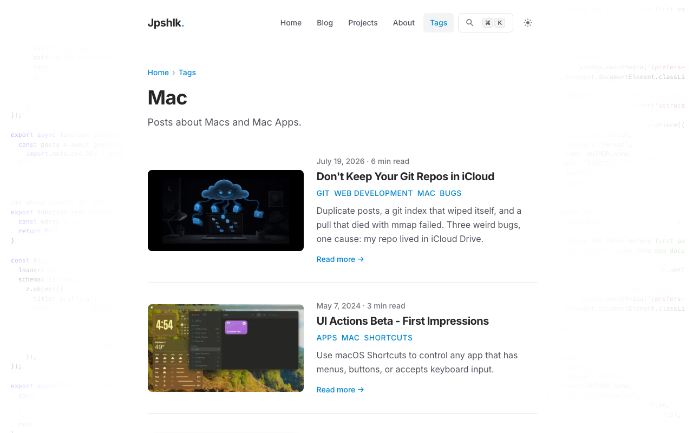

*This is part 6 of my [rebuild series](/tags/rebuild/). In [part 5](/blog/turning-my-homepage-into-a-landing-page/) I turned the homepage into a landing page.*

On the old site, tags were whatever strings I happened to type into a post's frontmatter (the metadata block at the top of the file). Nothing stopped `mac`, `Mac`, and `macs` from quietly becoming three different topics. On the rebuild, tags became their own content collection: every tag on this site is a small MDX file with a name, a description, and room to grow.

That sounds like overkill for a personal blog. It stopped sounding like overkill the first time I typo'd a tag and the build failed instead of silently shipping a broken tag page.

## Tags as a content collection, not strings

In Astro, a content collection is a folder of files with a schema: the build reads every file and type-checks its frontmatter before anything renders. The tags collection sits right next to the blog in `content.config.ts`:

```ts
const tags = defineCollection({
  loader: glob({ pattern: '**/*.mdx', base: './src/content/tags' }),
  schema: z.object({
    name: z.string(),
    description: z.string().optional(),
  }),
});
```

The important half lives on the blog side. Posts don't declare their tags as plain strings; they declare references into that collection:

```ts
tags: z.array(reference('tags')).default([]),
```

`reference('tags')` means every tag in a post's frontmatter has to match a real file in `src/content/tags/`. Write `tags: ['astr']` and the build stops with an error naming the post and the bogus tag. The typo that used to become a ghost page is now a compile error.

## What a real tag page buys you

A slug like `ios` can't tell you it should be displayed as "iOS" and not "Ios". A file can. Every tag carries a proper display name and a one sentence description:

```mdx
---
name: Rebuild
description: Documenting the 2026 rebuild of this site with Astro 7, Tailwind 4, and a lot of help from AI.
---
```

The tag page template reads both. The name becomes the heading and the breadcrumb, correctly capitalized, and the description renders right under the heading and doubles as the page's SEO description. So a tag page opens with an actual sentence about the topic instead of a bare slug floating over a list:



Two smaller wins ride along. A tag with zero published posts gets no page at all (the route only generates when something actually uses it), so there are no empty stubs for crawlers to find. And because the files are MDX, each tag has a body waiting for the day I want tag pages to open with a real intro; the rebuild tag already has one written, sitting in its file until I wire it up.

## The cost side

The price is one small file per tag, and you pay it up front: a tag can't exist until its file does. Tagging a post with something new means stopping to create `src/content/tags/whatever.mdx` first.

That friction annoyed me for about a day. Then I noticed it was doing exactly what a taxonomy needs: making me decide whether a topic really deserves a tag before it exists. Is it `webdev`, `web-dev`, or `web-development`? There's one file, so there's one answer. The site has seventeen tags with real names and descriptions, and that beats forty misspelled strings every time.

If your tags are strings that occasionally typo into ghost pages, give them files. It's the rare bit of structure that costs one folder and pays you back on every post. 🤙
