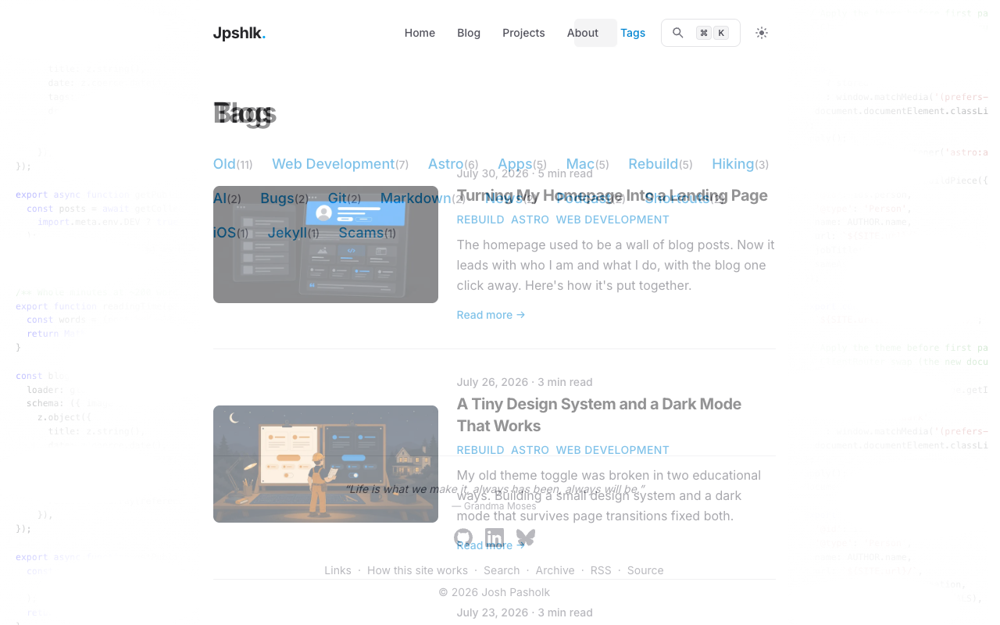

The nav on this site has a little party trick: a soft pill that slides from one link to the next when you change pages. It runs on view transitions, the browser feature that animates between page loads, and I was pretty proud of it.

Then I actually watched it. Every click made the nav text flicker. Clicking Tags shoved the whole nav a few pixels to the right. Two glitches, and neither showed up in DevTools, because neither one technically exists in the page.

## What the pill was doing

The pill is one absolutely positioned `<span>` inside the active link, pushed behind the text with a negative z-index and given an Astro `transition:name`. That name is the whole trick: on navigation the browser sees a pill on the old page and a pill on the new page and morphs one into the other. No JavaScript.

Here's the part I didn't know. During a view transition the browser doesn't animate your actual elements. It takes snapshots of them, basically screenshots, and animates those on a layer above the page. Any element with a transition name gets promoted to its own snapshot, and those snapshots stack in the order things paint, not the order your z-indexes say.

So for a few hundred milliseconds on every click, my pill stopped being a background and became a sticker on top of the entire page. An opaque rounded rectangle sliding across the nav, hiding every label it passed, then parking on top of the destination label until the fade finished. The flicker was the pill literally driving over the text.

## One line of z-index

Two changes fixed it, both small.

First, the header opts out of the page crossfade entirely:

```astro
<header
  transition:name="site-header"
  transition:animate="none"
  class="mx-auto flex w-full max-w-3xl items-center justify-between px-4 py-6 sm:px-6"
>
```

Naming the header gives it its own snapshot, separate from the rest of the page. Setting its animation to none means that snapshot doesn't fade, slide, or morph. The site name and links now swap in place instantly while the page content crossfades behind them.

Second, the actual one-liner. Snapshots can be styled like any other element, so I told the header's snapshot to sit above the pill's:

```css
::view-transition-group(site-header) {
  z-index: 1;
}
```

The header snapshot is just text on a transparent background, so raising it covers nothing except the thing that was misbehaving. The pill now slides underneath the labels, exactly like it layers in the real DOM.

While I was in there I synced the pill's timing. It was running three different clocks: Astro's 180ms fades, the browser's default 0.25s morph, and my 0.4s page fade. One rule now sets all three to 0.3s, so the pill settles just before the page does.

## The sideways shuffle

The second bug had nothing to do with view transitions. It just looked related because the transition animated the evidence.

My [tags page](/tags/) is the only nav destination short enough that it doesn't scroll. Land on it and the scrollbar disappears, the viewport gets wider, and everything centered re-centers a few pixels to the right. The nav wasn't moving. The entire page was.

CSS has a one-line fix for this too:

```css
html {
  scrollbar-gutter: stable;
}
```

That reserves the scrollbar's lane even when there's nothing to scroll, so short pages and long pages share the same geometry. If you're on a Mac with overlay scrollbars you never saw this bug. Plug in a mouse, or be any Windows user, and it's there on every centered layout that doesn't set this.

## Freezing time to prove it

My favorite part was proving the fix. You can't screenshot a 400ms animation by being fast. But view transition snapshots are driven by regular CSS animations, and regular CSS animations can be paused:

```css
::view-transition-group(*),
::view-transition-old(*),
::view-transition-new(*) {
  animation-duration: 5s !important;
  animation-delay: -2.5s !important;
  animation-play-state: paused !important;
}
```

Five second duration, started negative two and a half seconds in, paused. Every transition freezes at its exact midpoint, indefinitely, and you can inspect it like a museum exhibit.

One gotcha if you try this on an Astro site: the router diffs the document head on every swap and strips styles it doesn't recognize, so you have to re-add the test style to the incoming document on `astro:before-swap` or it vanishes right before the moment you care about.

Here's the frozen midpoint after the fix. The page behind is mid-crossfade, the labels are sharp, and the pill is caught mid-slide under About:



## What I took away

**A transition name pulls the element out of your stacking order.** Whatever careful layering an element has inside the page, its snapshot ignores it. If layering matters during the transition, style the snapshot pseudo-elements, not the element.

**scrollbar-gutter: stable belongs on basically every centered layout.** One declaration, and the whole category of "the page shifted when the scrollbar left" is gone.

**When an animation misbehaves, freeze it.** Squinting at a 400ms blur teaches you nothing. A paused transition tells you everything, on your schedule.

The nav is anchored now, the pill still does its trick, and the [how this site works](/how-this-site-works/) page got a new paragraph. 🤙
