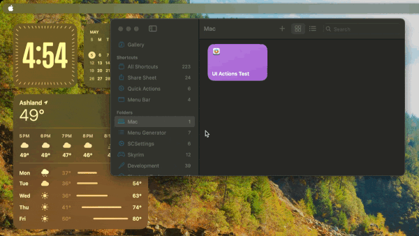
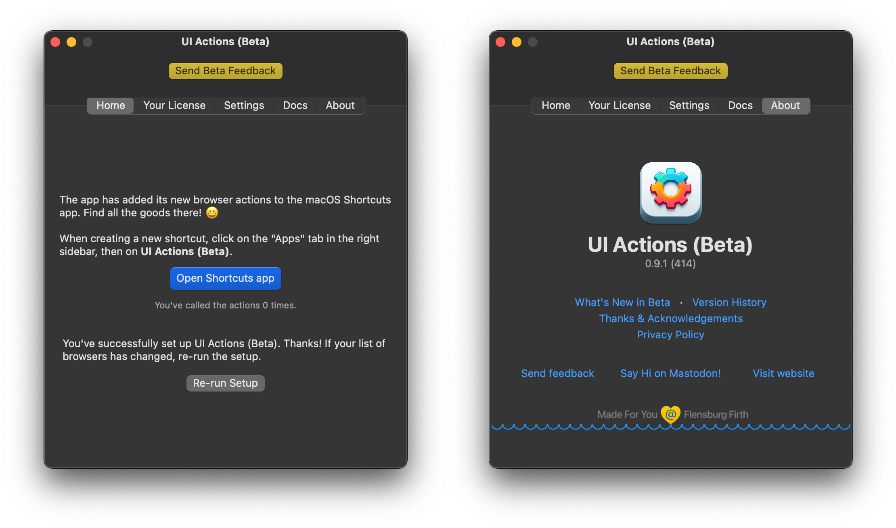
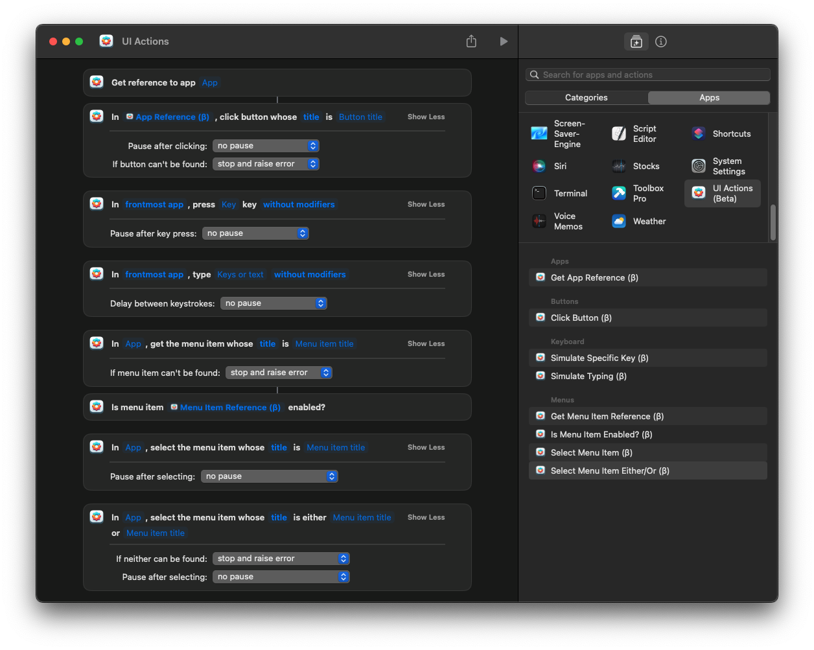
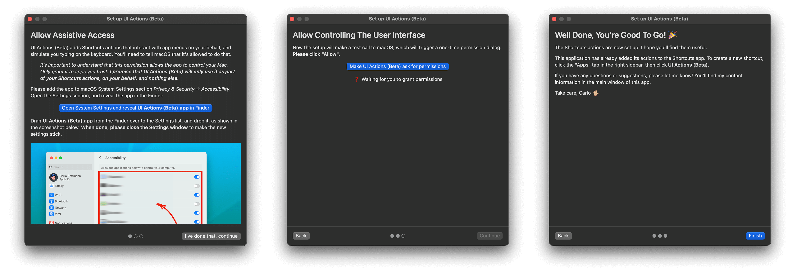

import Link from "../../components/Link.astro";

I saw this after signing up and browsing Mastodon this weekend, and it looks amazing for an early beta!

## What Is Shortcuts And Why Should You Care?

Shortcuts was released in September 2018 as a part of iOS 12 after Apple purchased Workflow, which allowed users to create powerful automations by connecting different apps and services without needing to understand how to code.

Victor Sanchez has <Link href={`https://blog.routinehub.co/the-comprehensive-history-of-apple-shortcuts/`} class="text-primary-500 hover:text-sky-600 dark:hover:text-primary-400">a great write-up</Link> on the history of Shortcuts on RoutineHub's blog. It is a must-read, so go check that out!

In October of 2021, Apple finally brought Shortcuts to macOS with the release of Monterey. Shortcuts can sync over iCloud, allowing users to build Shortcuts on their Mac with a lot of crossover functionality.

While it is really good, *when the UI doesn't completely lag-out from scrolling through large Shortcuts*, there are many things left to be desired.

## Enter UI Actions - Control Mac Apps With Shortcuts

UI Actions is currently in beta and under active development, with version `0.9.1` being the latest release as of this writing. So far, I am very impressed with the potential of this project.

While I've only had the time to build a few Shortcuts using it, the experience has been quite good. The actions are intuitive and easy to understand, even for someone who may not be seasoned with automation.

I would hope that most people understand how to click `File > Save` or `Edit > Paste`.

### The actions included are quite good and have the potential to automate a lot of tasks:

- **Get App Reference:** References other apps for use in other actions.
- **Click Button:** Tries to click a button by title.
- **Simulate Specific Key:** Simulates pressing certain keys like `Home`, `Escape`, or `Return` with modifiers like `Cmd`, `Opt`, etc.
- **Simulate Typing:** Simulates typing text on the keyboard, like the example in the gif above.
- **Get Menu Item Reference:** Tries to find a UI menu item, and returns it as text like so: `App Name: Menu Item Name`.
- **Is Menu Item Enabled?:** Returns a boolean value for the state of a menu item.
- **Select Menu Item:** Tries to find a menu item and trigger it.
- **Select Menu Item Either/ Or:** Useful for menu items that can change state.

## Setting Up UI Actions

After installing you'll need to go through setting up the proper permissions for UI Actions to work; this includes `Allow Assitive Access` and `Allow Controlling The User Interface` for obvious reasons.

Once you allow those permissions, it should be all set up and ready to go.

## Download The Beta And Check Out The Forum

If this looks like something you'd like to try out, head over to <Link href={`https://actions.work/ui-actions`} class="text-primary-500 hover:text-sky-600 dark:hover:text-primary-400">ActionsDotWork</Link> to download the public beta, and check out the <Link href={`https://forum.actions.work/c/ui-actions/11`} class="text-primary-500 hover:text-sky-600 dark:hover:text-primary-400">forum</Link> to learn more and report any bugs you find.

While you're at it, give him a <Link href={`https://norden.social/@czottmann`} class="text-primary-500 hover:text-sky-600 dark:hover:text-primary-400">follow on Mastodon</Link> and take a look at some of his other projects as well! 

***

As always, thanks for stopping by and I hope you check out UI Actions. If you enjoyed reading about it let me know what you think in the comments below.

Have a good one, peace! 🤙